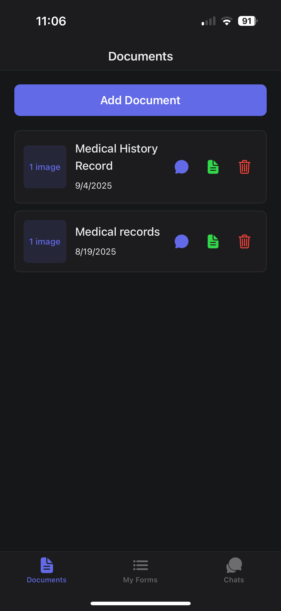
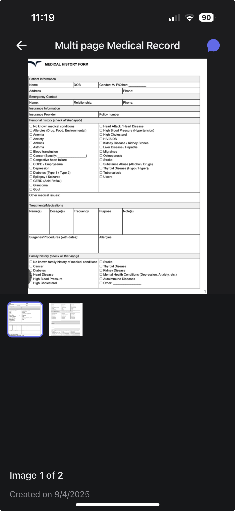
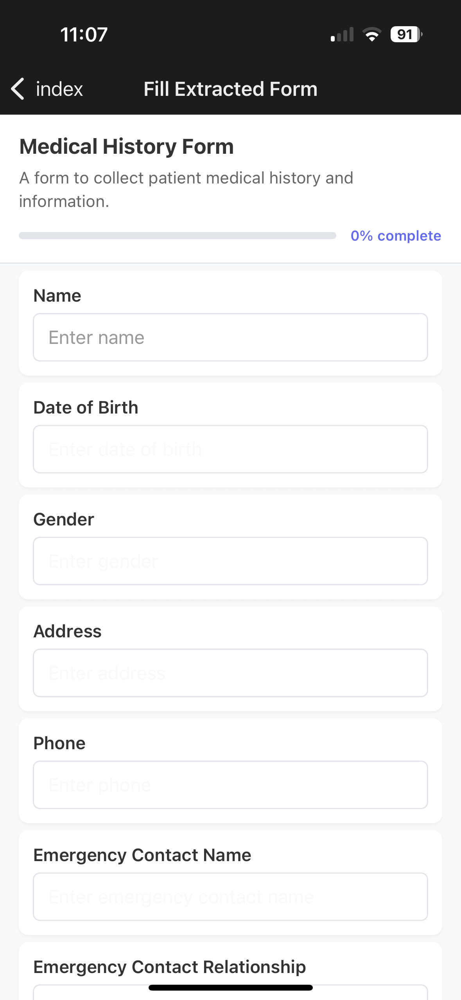
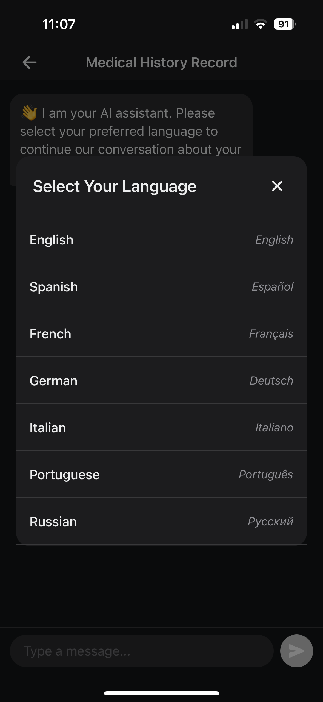
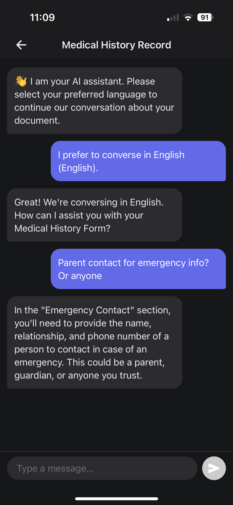

# Inga

> 🏆 **Winner of the Diamond Hacks 2025 Patient Safety Sponsor Award**

**Contributors:**  Ninad Satish • Iha Gadiya  

## Purpose

Inga is an experimental assistant and document management app built for DiamondHacks 2025.  
It helps users to better understand their medical (and other) documents by bridging language barriers and simplifying complex medical terminology, using LLMs. The app helps users securely upload, scan, fill, and manage documents while providing multilingual chat support for improved comprehension and accessibility.

## Feature Functionality

<div align="center">

  <table>
    <tr>
      <td align="center">
        <br/>
        <sub><b>App Landing Page</b></sub>
      </td>
      <td align="center">
        <br/>
        <sub><b>Multi-page Document Upload</b></sub>
      </td>
      <td align="center">
        <br/>
        <sub><b>Multi-page Preview</b></sub>
      </td>
    </tr>
    <tr>
      <td align="center">
        <br/>
        <sub><b>Form Filling</b></sub>
      </td>
      <td align="center">
        <br/>
        <sub><b>Language Selection</b></sub>
      </td>
      <td align="center">
        <br/>
        <sub><b>Chat Simplification</b></sub>
      </td>
    </tr>
  </table>

</div>

- Modern UI built with Expo and React Native.
- Upload, scan, and securely store multi-page medical documents and images.
- Preview and fill forms digitally, then save finalized PDFs.
- Choose your chat language and get simplified explanations of medical terms.

## Tools Used

- **React Native** (with Expo, a React Native framework)
- **Supabase** (database, authentication, storage, edge functions)
- **OpenAI** (for chat and language simplification)
- **Expo Router** (for navigation)
- **TypeScript** (for type safety)


## Architecture

- **Mobile app:** provides a simple frontend for users to interact with the app, with some data stored on device.
- **Supabase:** provides database, storage, authentication, and secure proxy functions for OpenAI
- **Security:** all API requests are handled by Supabase functions and require authentication. OpenAI API keys are stored server-side, images are accessed via signed URLs, and users can only access their own data (enforced by Postgres Row Level Security policies).


## Get Started

1. **Install dependencies**
   ```bash
   npm install
   ```

2. **Add environment variables to the `.env` file**
   ```
   SUPABASE_URL=your-supabase-url
   SUPABASE_ANON_KEY=your-supabase-anon-key
   ```

3. **Deploy Supabase Functions (if using your own Supabase project)**
   ```bash
   cd supabase/functions
   chmod +x deploy.sh
   ./deploy.sh
   ```
   Set these secrets for the functions. You may need to create a [Supabase project](https://supabase.com/) first.
   ```bash
   supabase secrets set OPENAI_API_KEY=your-openai-api-key
   supabase secrets set SUPABASE_SERVICE_ROLE_KEY=your-service-role-key
   ```

4. **Start the app**
   ```bash
   npx expo start
   ```

   After running `npx expo start`, you will see options in your terminal to open the app in several environments:

   - **Development build:** For full native features and debugging ([setup guide](https://docs.expo.dev/develop/development-builds/introduction/))
   - **Android emulator:** Press `a` to launch the app in Android Studio's emulator ([setup guide](https://docs.expo.dev/workflow/android-studio-emulator/))
   - **iOS simulator:** Press `i` to launch the app in Xcode's iOS simulator ([setup guide](https://docs.expo.dev/workflow/ios-simulator/))
   - **Expo Go:** Scan the QR code with the Expo Go app on your iOS or Android device ([Expo Go](https://expo.dev/go)). This is a quick way to preview the app, but some native features may be limited.

   Choose the option that matches your development setup. For most features, a development build or emulator/simulator is recommended.

> [!WARNING]
> This app is an experimental project for public use and **does not fall under HIPAA compliance**.  
> No liability is taken for the handling, storage, or transmission of medical data.  
> Please do not use this app for sensitive or regulated medical information.
